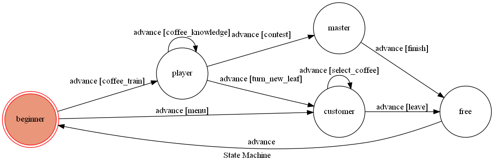
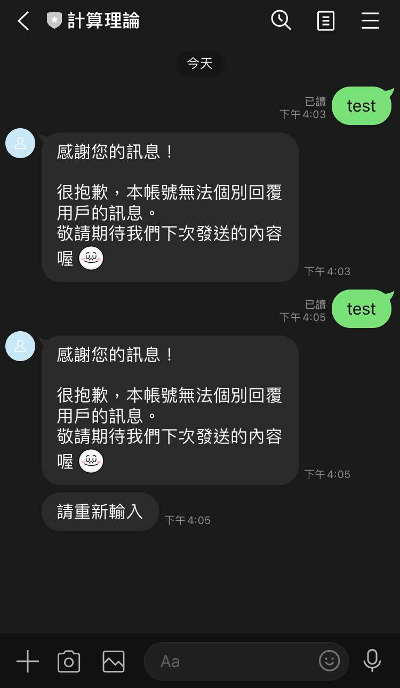
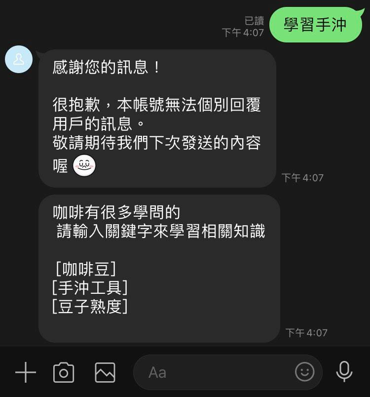
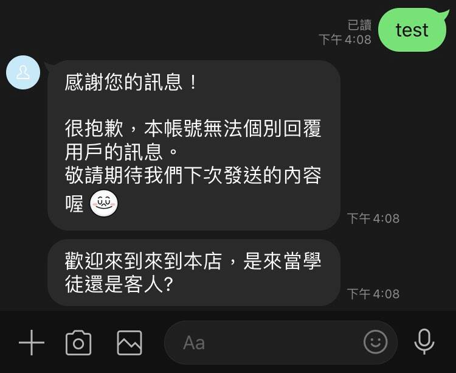
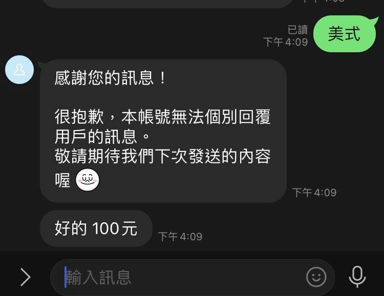

# FSM Line Chatbot

## 構想
設計一個chatbot將使用者拆分為 1. 學習咖啡知識者 2. 消費者
若為學習咖啡者，可透過輸入特定關鍵字，來學習咖啡豆、咖啡相關器材等知識
若為消費者，可根據菜單上有什麼品項並輸入後，作為點餐的方式

## Finite State Machine


## States

In every states if the bot doesn't know the input message, it will reply ```請重新輸入```

### beginner
The initial state is set to ```beginner```.

### player
The state of being a coffee player. You can input some keywords here, for example
```
* Input : "咖啡豆"
		* Reply : "分為兩種，羅布斯塔與阿拉比卡"

* Input : "手沖工具"
		* Reply : "手沖壺、濾紙、濾杯、磨豆機"		
```
### master
The state of being a coffee master. You are already have enough knowledge.

### customer
The state of begin a customer in coffe shop. You can input some keywords here, for example
```
* Input : "美式"
		* Reply : '美式為100元'
* Input : "拿鐵"
		* Reply : '拿鐵為120元'

```
### free
The state of being a space state.

---

## 使用範例









---

[](https://codeclimate.com/github/NCKU-CCS/TOC-Project-2020/maintainability)

[](https://snyk.io/test/github/NCKU-CCS/TOC-Project-2020)


A Line bot based on a finite state machine

More details in the [Slides](https://hackmd.io/@TTW/ToC-2019-Project#) and [FAQ](https://hackmd.io/s/B1Xw7E8kN)

## Setup

### Prerequisite
* Python 3.6
* Pipenv
* Facebook Page and App
* HTTPS Server

#### Install Dependency
```sh
pip3 install pipenv

pipenv --three

pipenv install

pipenv shell
```

* pygraphviz (For visualizing Finite State Machine)
    * [Setup pygraphviz on Ubuntu](http://www.jianshu.com/p/a3da7ecc5303)
	* [Note: macOS Install error](https://github.com/pygraphviz/pygraphviz/issues/100)


#### Secret Data
You should generate a `.env` file to set Environment Variables refer to our `.env.sample`.
`LINE_CHANNEL_SECRET` and `LINE_CHANNEL_ACCESS_TOKEN` **MUST** be set to proper values.
Otherwise, you might not be able to run your code.

#### Run Locally
You can either setup https server or using `ngrok` as a proxy.

#### a. Ngrok installation
* [ macOS, Windows, Linux](https://ngrok.com/download)

or you can use Homebrew (MAC)
```sh
brew cask install ngrok
```

**`ngrok` would be used in the following instruction**

```sh
ngrok http 8000
```

After that, `ngrok` would generate a https URL.

#### Run the sever

```sh
python3 app.py
```

#### b. Servo

Or You can use [servo](http://serveo.net/) to expose local servers to the internet.


## Deploy
Setting to deploy webhooks on Heroku.

### Heroku CLI installation

* [macOS, Windows](https://devcenter.heroku.com/articles/heroku-cli)

or you can use Homebrew (MAC)
```sh
brew tap heroku/brew && brew install heroku
```

or you can use Snap (Ubuntu 16+)
```sh
sudo snap install --classic heroku
```

### Connect to Heroku

1. Register Heroku: https://signup.heroku.com

2. Create Heroku project from website

3. CLI Login

	`heroku login`

### Upload project to Heroku

1. Add local project to Heroku project

	heroku git:remote -a {HEROKU_APP_NAME}

2. Upload project

	```
	git add .
	git commit -m "Add code"
	git push -f heroku master
	```

3. Set Environment - Line Messaging API Secret Keys

	```
	heroku config:set LINE_CHANNEL_SECRET=your_line_channel_secret
	heroku config:set LINE_CHANNEL_ACCESS_TOKEN=your_line_channel_access_token
	```

4. Your Project is now running on Heroku!

	url: `{HEROKU_APP_NAME}.herokuapp.com/callback`

	debug command: `heroku logs --tail --app {HEROKU_APP_NAME}`

5. If fail with `pygraphviz` install errors

	run commands below can solve the problems
	```
	heroku buildpacks:set heroku/python
	heroku buildpacks:add --index 1 heroku-community/apt
	```

	refference: https://hackmd.io/@ccw/B1Xw7E8kN?type=view#Q2-如何在-Heroku-使用-pygraphviz

## Reference
[Pipenv](https://medium.com/@chihsuan/pipenv-更簡單-更快速的-python-套件管理工具-135a47e504f4) ❤️ [@chihsuan](https://github.com/chihsuan)

[TOC-Project-2019](https://github.com/winonecheng/TOC-Project-2019) ❤️ [@winonecheng](https://github.com/winonecheng)

Flask Architecture ❤️ [@Sirius207](https://github.com/Sirius207)

[Line line-bot-sdk-python](https://github.com/line/line-bot-sdk-python/tree/master/examples/flask-echo)
